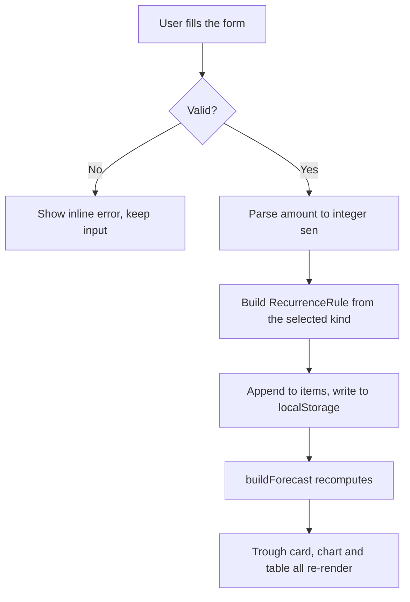
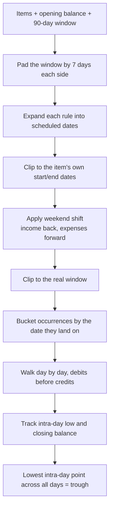

# Cash-Flow Forecaster

Plug in your income and recurring bills and see your projected balance day by day
so that you know exactly when things get tight.

The useful output isn't the month-end number as most people can work that out. It's
the **lowest point**: which day your balance bottoms out, how far it drops, and
whether it goes negative before the next payday lands. That's the question a
spreadsheet answers badly because bills land on cycles that don't line up with
each other or with the calendar.

Built for the Shortcut Asia internship challenge (topic 03).

---

## Running it

Requires Node 18+.

```bash
git clone https://github.com/Divi19/cashflow-forecaster
cd cashflow-forecaster
npm install
npm run dev       # http://localhost:5173
npm test          # 34 tests
npm run build     # type-check + production build
```

The app seeds itself with a sample Malaysian month on first load, so there's nothing
to configure. You just have to open it and there's a populated forecast. "Reset to 
sample data" restores it if you clear things out. Hopefully you find it simple enough
to use as it is purely just an mvp.

---

## How I approached it

The brief says two solid features beat ten half-built ones, so I scoped hard up
front: **add income and recurring expenses** and **a forecast view**. Everything
else was written down as deliberately out of scope rather than left as an open
question.

I built the logic before the interface. The recurrence engine and the projection
were written as pure functions with a test suite and only once those were green did
anything get rendered. That ordering was deliberate: the hard part of this problem is
calendar arithmetic which is invisible in a UI and obvious in a test. Debugging a
wrong date through a chart would have been extremely tedious.

The order of work, which the commit history follows:

1. Scaffold, data model, calendar-date helpers
2. Recurrence engine + 16 tests
3. Forecast projection + trough finder + 11 tests
4. Seed data and a plain table — first visible output
5. Persistence, add/delete, editable opening balance
6. Chart, then a table view toggle
[This plan split was suggested by AI and then altered after some back and forth sessions
on how exactly we should approach this topic]

---

## Tech stack, and why (As straightforward as it gets in order to keep things simple and lightweight for myself and because the requirements says as such. The whole purpose is to deliver an mvp rather than a fully fledged out project)

| Choice | Why |
|---|---|
| **Vite + React + TypeScript** | No server-side rendering needed, so Next.js would have added routing and build complexity for nothing. TypeScript matters here because the recurrence rules are a discriminated union — the compiler catches an unhandled rule kind, which is exactly the bug class that hurts in date logic. |
| **Recharts** | Declarative React charting. It dominates the bundle (~168 kB gzipped), which I'd revisit on a real product — see Limitations. |
| **No date library** | date-fns and friends operate on `Date` objects carrying a time and a timezone. Every date in this app is a plain calendar date — a bill due on the 1st is due on the 1st everywhere — so I wrote ~40 lines of UTC-based helpers instead. Fewer dependencies, and no chance of a timezone silently shifting an annual renewal into the wrong month. |
| **localStorage, no backend** | Single user, single device, no accounts, no sharing. A server would add auth, hosting and a schema for zero benefit to the one person using it. |

---

## Architecture (Just the general file structures)

```
src/
  lib/                 pure logic, no React, fully unit tested
    dates.ts           calendar-date arithmetic (UTC-based)
    types.ts           data model: CashItem, RecurrenceRule, Forecast
    recurrence.ts      rule + window -> occurrence dates
    forecast.ts        occurrences + opening balance -> daily series + trough
    money.ts           integer-sen parsing and formatting
    storage.ts         localStorage load/save with fallback
    seed.ts            sample data
  components/          presentation only, no business logic
    ItemForm.tsx       add an item
    ItemList.tsx       list and delete
    BalanceChart.tsx   Recharts line + trough marker
  App.tsx              owns state, composes the above
```

The split is the point: everything in `lib/` is a pure function that takes data and
returns data. That's what makes the correctness testable without rendering anything,
and it means the UI can be rewritten without touching the logic that matters.

State lives in one place — `App.tsx` holds `{ openingCents, items }`, writes it to
localStorage on change, and recomputes the forecast with `useMemo`. No state library;
there isn't enough state to justify one.

---

## How it works (Flowcharts to make it more clear on the process rather than wording)

### Adding an item and getting a forecast



### Inside the forecast



The padding in step 2 exists because the weekend shift can move a date across a
window boundary in either direction. Generating narrow and shifting afterwards would
drop occurrences that belong in the window and keep ones that don't.

---

## Key technical decisions

**Month-end clamping.** A monthly rule on the 31st clamps to the last day of short
months — 28 Feb, or 29 in a leap year. The alternative was skipping the month
entirely, which I rejected: real billers bill, they don't skip February.

**Every-N-days is not twice-a-month.** These look interchangeable and aren't. Every
14 days produces 26 payments a year; the 1st and 15th produces 24. Two months a year
have three fortnightly paydays. Conflating them makes a forecast drift by a whole
payment, so they're separate rule kinds.

**Weekend shifts go in opposite directions.** Salary due Saturday arrives Friday; a
bill due Saturday clears Monday. Same weekend, opposite shift. The direction is
derived from whether money is coming in or going out.

**The trough uses the intra-day low, not the closing balance.** If rent leaves and
salary arrives on the same date, the account dips before it recovers. A forecast that
only looked at closing balances would report that day as healthy and miss a real
overdraft.

**Money is stored as integer sen throughout.** `12.10 * 100` is `1209.9999999999998`
in floating point. Amounts are parsed to integers at the input boundary and only
converted for display, so nothing downstream can drift.

---

## Verification

34 tests, all on the pure logic in `lib/`. Run them with `npm test`.

**`recurrence.test.ts` (16)** : month-end clamping including leap years, every-14-days
versus semi-monthly across a full year, walking backwards from an anchor that sits
after the window, weekend shifts in both directions, window boundaries, item
start/end bounds, sign handling, sort order.

**`forecast.test.ts` (11)** : includes a golden scenario with balances simple enough to check against a calendar by hand. Also covers same-day ordering, the intra-day dip, trough tie-breaking
to the earliest date, and the flat case where nothing happens.

**`money.test.ts` (7)** : amount parsing, including the floating-point cases that
motivated integer sen in the first place.

**What isn't tested:** the React components, localStorage round-tripping, and the
chart. Those were checked by hand — adding an item and refreshing to confirm
persistence, and cross-checking that the chart's trough marker sits on the same date
the table highlights. Given more time, component tests around the form validation
would be the first thing I'd add.

---

## Where I used AI

See `AI-LOG.md` for the full record. In summary: AI wrote most of the code from
specifications I set, and I own the result - the decisions above are mine, the tests
encode semantics I chose, and I verified the output rather than assuming it.

---

## Limitations (TLDR: What I wish I could fix with more time basically, a lot because I wanted to do a lot more with this project initially)

- **Data is local only.** Clearing the browser wipes it, and it doesn't follow you to
  another device. Acceptable for a single-user tool; the first thing to change if
  this were real.
- **Limited chart types.** Currently only has a traditional line chart but some users
  might want to see more clearly how much each type of transaction contributes to loss
  in for example a pie chart. Alternatively they may want a bar chart for more effective
  comparions. Data visualization is limited currently.
- **No editing.** Items can be added and deleted but not modified — you delete and
  re-add. A deliberate scope cut, and the first feature I'd add next.
- **Cash flow graph is basic.** It utilizes a standard green color even if the chart
  is on a purely downward trend and it lacks extra information such as percentage 
  change over the period. It also does not allow a filter for specific months.
- **Fixed 90-day window.** Long enough to catch an annual renewal but not really
  adjustable. Not having a full year data is a slight limitation.
- **The bundle is dominated by the chart library** (~168 kB gzipped of ~168 kB
  total). On a real product I'd lazy-load Recharts; for a single-screen app the
  indirection isn't worth it.
- **No timezone handling for users outside Malaysia.** Dates are plain calendar
  dates, which is correct, but "today" is read from the browser's local clock.
- **Weekend shifting doesn't know about public holidays.** A bill due on Hari Raya
  will show as landing that day.
- **Long logs shown.** Below the visualization is a long log of the whole transaction
  history as the deafult which is slightly messy and can cascade longer with more data.
- **Multiple transactions on the same day is limited in display.** You are unable to
  see how much each transaction contributed individually to the number shown on the
  balance number

---

## What changed once I used it (A brief view into how my brain contributed to the logic alongside the AI-assisted building process)

- **Empty days made the table useless.** 91 rows may be unreadable for some, so I added
  a filter to just the active days where a deduction or addition happened so that fewer
  rows were shown. This improves readability for the user and made it easier for me to
  analyze any anomalies in the transations during debugging.
- **The weekend shift is correctly encapsulated.** Rent set for the 1st could show up
  on a weekend but however, bank payments actually queue until the next business day
  and does not get settled during weekends. I added a weekend shift to push the expenses
  forward whilst pulling income back since employers pay early rather than late. Card
  payments on the other hand, can still land on any day. Wanted to keep it systematically
  correct.
- **No months' payments were skipped.** Having the billings be fixed on day 31 skips months
  like February, April, June, September and November. This amounts to five months a year
  silently missing. It clamps to the last day now: 28 Feb or 29 in a leap year and 30 in
  the short months. Rolling into the 1st of the next months would shift the bill into the
  next cycle and double the counts of one month while emptying another which is an incorrect
  piece of logic.
- **Added the reset button.** Purely for a developer perspective during testing. Once I deleted
  sample items, there was no way back to a populated state to check something. Took a couple of
  minutes to implement and has saved loads of minutes during experimentation time.

---
